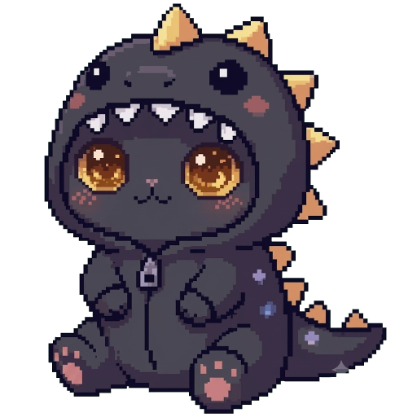
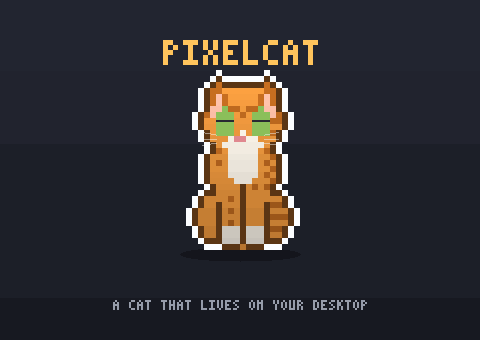
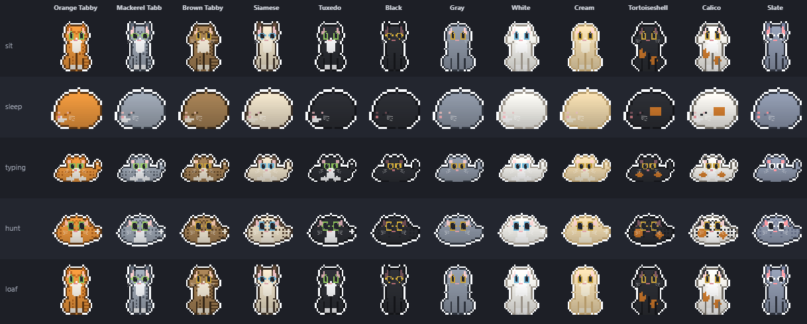

<div align="center">



# PixelCat

### A cute pixel cat that lives on your desktop.

It sits in the corner, follows your cursor, kneads your keyboard when you type,
purrs when you pet it, and stretches like mochi when you drag it — a from-scratch
desktop pet where nearly every sprite, animation, and sound is **original and
procedural**.

<br />

[](https://github.com/JOhnsonKC201/pixelcat/actions/workflows/ci.yml)
&nbsp;-4C566A?style=flat-square&labelColor=15161d)
&nbsp;
&nbsp;
&nbsp;

<br />



<br />
<br />

[](https://github.com/JOhnsonKC201/pixelcat/releases/latest)
&nbsp;
[](https://pixelcat-jet.vercel.app)

<sub>Pet it, type at it to make it knead, scroll to rope-climb, and watch for the butterfly — no install.</sub>

</div>

<br />

## Highlights

<table>
<tr>
<td width="33%" valign="top">

**🐾 Actually alive**

Reacts to touch, cursor, and typing, with an internal mood/energy model — calm → playful → zoomies.

</td>
<td width="33%" valign="top">

**🎨 14 coats + custom**

One role-coded sprite recolored per pattern. Design your own coat and import/export it.

</td>
<td width="33%" valign="top">

**🎧 100% procedural**

Meow, purr, chirp, and a live lo-fi jam — all Web Audio synthesized in code. No asset files.

</td>
</tr>
<tr>
<td width="33%" valign="top">

**🍅 Focus companion**

Break/Pomodoro timers, reminders, notes, and IMAP mail + `.ics` calendar nudges — every alert through the cat.

</td>
<td width="33%" valign="top">

**🤖 AI-agent aware**

Ponders, taps along, and hops when your coding agent finishes. Ready hooks for 5 agents.

</td>
<td width="33%" valign="top">

**🪟 Floats over everything**

A transparent, click-through overlay that stays on top — the cat is the only thing you can click.

</td>
</tr>
</table>



## Quick start

**Just want the cat?** Grab the Windows installer — no git or Node needed, just run it:

### ⬇ [Download for Windows](https://github.com/JOhnsonKC201/pixelcat/releases/latest)

Prefer to try before installing? **[Play with the cat in your browser →](https://pixelcat-jet.vercel.app)** — no install.

**Run from source** (to develop, or to run on macOS):

```powershell
git clone https://github.com/JOhnsonKC201/pixelcat.git
cd pixelcat
npm install
npm start
```

Either way, the cat appears in the corner and starts at login from now on.
To stop it launching at login: `npm run autostart:off`.

> **macOS (beta):** same commands. On first run, grant **Accessibility permission**
> (System Settings → Privacy & Security → Accessibility) so the cat can react to your
> typing and cursor — input is only *detected*, never logged or sent anywhere. The mac
> port is code-complete but **not yet smoke-tested on real hardware** — see the
> [build checklist](#build-a-standalone-app); issues welcome.

## Contents

- [Meet the cat](#meet-the-cat) — interactions, moods, art
- [Stay on track](#stay-on-track) — timers, reminders, mail & calendar
- [Controls](#controls)
- [AI agent reactions](#ai-agent-reactions)
- [Custom coats](#custom-coats)
- [Build a standalone app](#build-a-standalone-app)
- [How it works](#how-it-works)
- [Development](#development)

---

## Meet the cat

The whole point: a pet that *feels* alive on your desktop. It reacts to touch,
to your cursor, to your typing, and to its own internal mood.

| Interaction | What the cat does |
|-------------|-------------------|
| 🖱️ **Drag it** | Stretches like mochi (head & feet stay solid, body thins), then squashes & bounces back. Shake it side-to-side and it wobbles like jello with a startled *mrrp*. Stays where you drop it. |
| 💜 **Pet its head** | Closes its eyes happily, wiggles, and floats little hearts — with a purr. |
| 🫳 **Touch its body** | Leans and arches into your hand, tail up, trilling. |
| 👆 **Tap it** | A quick pet — happy eyes, hearts, a chirp. |
| 👀 **Move your cursor** | The cat watches it and blinks now and then. Flick it fast and the cat crouches, stalks, and **pounces**. A sudden jolt **startles** it (puffs up, freezes, then bolts or creeps back). |
| ⌨️ **Type in any app** | It leans onto two big keys and **kneads them with its paws**; type fast and it **overheats** (turns red with steam), then cools down. |
| 🧶 **Scroll anywhere** | Grabs a yarn rope and **climbs** it hand-over-hand — up when you scroll up, down when you scroll down — with a ball of yarn anchored on the floor. |
| 🦋 **Wait for a visitor** | Once in a while a butterfly flutters in. The cat tracks it, swats at it, and now and then **pounces and catches it** between its paws — then it flutters off again. **Step away** and a butterfly comes out on its own so the cat always has something to play with. |
| 🍃 **Leave it be** | Left alone it keeps itself busy — **bats a drifting leaf with a paw**, washes its face, loafs, and its whiskers twitch — lively without ever getting in your way. |
| 👋 **Come back** | Return after being away and the cat **notices you** — happy eyes, a little heart, and a friendly chirp hello. |
| 🐟 **Give it a treat** | Tray → **Give a treat** drops a little fish; the cat **trots over and noms it** with hearts and a happy chirp. |
| 🌙 **Late at night** | After 23:00 the cat **winds down** — it settles to calm faster and loafs or dozes more (a nudge still rouses it). |

<details>
<summary><b>🎨 Coats &amp; pixel art</b> — 14 built-in patterns, custom coats, polished sticker look</summary>

- **14 coat patterns** — Orange / Mackerel / Brown tabby, Siamese, Tuxedo, Black,
  Gray, White, Cream, Tortoiseshell, Calico, Slate, Chocolate (a solid warm-brown
  Havana with green eyes), and Russian Blue (cool blue-grey with green eyes). Ships as
  **Tuxedo** out of the
  box; **right-click** the cat to cycle and your choice is remembered.
- **Custom coats** — design your own (see [Custom coats](#custom-coats)).
- **Polished pixel art** — white sticker outline (pops on any wallpaper), soft
  top-lit shading, whiskers, ground shadow, sparkly eyes.
- The cat is **one role-coded sprite** recolored per pattern at draw time — so a
  dozen cats come from one shape, and shading + outline + overheat tint apply for free.

</details>

<details>
<summary><b>🌙 Moods &amp; energy</b> — calm → playful → zoomies, driven by what you do</summary>

The cat tracks an internal **energy** value (0-100) that decays over time and is
bumped by stimuli (typing, scrolling, fast-mouse play, petting, an AI agent
finishing). Energy maps to three mood bands that gate and scale every reaction:

| Band | Energy | Behaviour |
|------|--------|-----------|
| **Calm** | 0-50 | Mellow — small, infrequent idle moves (loafs, grooms) |
| **Playful** | 51-80 | Full reactions (the original feel) |
| **Zoomies** | 81-100 | Frantic and fast, then a hard crash back toward calm |

Keep it busy and it gets the zoomies, then settles back down. **Startle** fires on
an abrupt cursor jump (no mic, fully local). Turn the whole system off with **Mood
reactions** (Settings or tray) for the classic always-playful behaviour. The tray
**Mood** submenu also has *Zoomies! / Calm down* to drive the model on demand.

</details>

<details>
<summary><b>🔊 Sound</b> — synthesized meow, purr, chirp, and mrrp (no audio files)</summary>

A **realistic synthesized** meow — a voiced sawtooth shaped by a moving mouth
formant (it opens into the "ee" and closes through the "ow"), with a breath of air
on the onset and gentle vibrato. Each meow randomly comes out as a short *mew*, a
two-syllable *meow*, or a drawn-out *meeow*, so it never sounds canned; pitch and
length also vary by **cat species**. Plus a purr, a rolled **chirrup/trill** (the
flutter cats greet you with), and a startled mrrp — all Web Audio synthesized in
code, no audio assets to ship. Toggle in Settings.

</details>

<details>
<summary><b>🖥️ Desktop-pet overlay</b> — floats over everything, never blocks your clicks</summary>

A full-screen, transparent, **click-through** layer — the cat floats over everything
but only the cat itself is interactive. It **stays on top of every app** (re-asserts
top-most, even over fullscreen windows), and you can confine it to a **Play area** —
pick a tray preset or **drag-to-draw** one (tray → Set play area). It **starts at
login** by registering itself in Windows startup.

</details>

## Stay on track

pixelcat doubles as a gentle, ambient productivity companion — every alert comes
through the cat (a meow + speech bubble), with an optional real desktop notification.

<details open>
<summary><b>⏱️ Timers</b> — break reminders &amp; Pomodoro</summary>

- **Break timer** — pick an interval and the cat **grows big to stretch with you**
  and meows, on a schedule. Or "Start break now."
- **Pomodoro timer** — set **focus/break loops** and a **pixel timer floats next to
  the cat** (tomato dot = focus, green = break). At each focus end the cat stretches
  with you; when the break ends it meows "Back to focus!". Toggle in Settings or tray.

</details>

<details>
<summary><b>🎸 Lobby Jam</b> — synthesized lo-fi study music the cat plays live</summary>

Flip on **Lobby Jam** (Settings or the tray submenu) and the cat picks up a little
guitar and plays an endlessly-improvising lo-fi loop — plucked Karplus-Strong
guitar over lazy jazz voicings, soft bass, brushed percussion, and tape warmth.
It's all Web Audio, generated live, with **no audio files**. Pick a mood:

| Mood | For |
|------|-----|
| **Cozy café** | A warm, easy background loop |
| **Dreamy** | Slow and washed-out, lots of reverb |
| **Upbeat lounge** | Brighter and a touch faster |
| **Deep focus** | Steady and minimal — almost no flourishes, so it stays out of the way while you work |
| **Rainy study** | A cozy loop over a soft, gusting rain bed |
| **Sleepy night** | Very slow, warm and dark — for late-night wind-down |

The music mixes through the same Volume control as the meow/purr, and the floating
notes + the cat's strumming bob along in time with the beat.

</details>

<details>
<summary><b>🔔 Reminders &amp; notes</b> — timed, repeating, snoozable</summary>

- **Reminders** — set a **time and message** and the cat **meows and shows a speech
  bubble**. Reminders can **repeat** (daily / weekdays / specific weekdays / once),
  can be **snoozed** from the tray, and support `{name}`, `{time}`, and `{date}`
  placeholders.
- **Pinned note** — pin an important message and it **stays in a bubble above the
  cat's head** until you clear it (reminders briefly take over, then it returns).
- **Calls you by name** — tell the cat your name in Settings (or use `{name}`) and it
  greets you by it.
- **Desktop alerts** — every reminder/message can also raise a **real Windows
  notification** and a sound, so you never miss it when you're not looking at the cat.

</details>

<details>
<summary><b>📬 Mail &amp; calendar</b> — IMAP unread alerts and <code>.ics</code> event nudges</summary>

- **Unread-mail alerts** — point the cat at your **IMAP inbox** (Gmail, Outlook, any
  IMAP) and it **tells you when new mail arrives**. Your app-password is stored
  **encrypted at rest** (Electron `safeStorage` / Windows DPAPI), never in
  `settings.json`, and the IMAP connection runs in an isolated worker process.
- **Calendar nudges** — paste your calendar's **secret `.ics` URL** (Google / Outlook
  both provide one) and the cat **nudges you a few minutes before each event**. The
  feed is fetched and parsed in an isolated worker.

</details>

<details>
<summary><b>📣 Notify the cat</b> — push any message from a script, CI, or cron job</summary>

**Any** script or tool can make the cat deliver an arbitrary message — a speech
bubble, a Windows toast, and a meow:

```bash
node scripts/notify.js "Build finished" --title CI --level success
node scripts/notify.js "Coffee break ☕" --ttl 8000
echo "anything" | node scripts/notify.js "Deploy done"   # hook-safe (drains stdin)
```

Flags: `--title <T>`, `--level info|success|warn|alert`, `--ttl <ms>`, `--no-sound`.
It appends one JSON line to `%TEMP%/pixelcat-notify.jsonl`, which the running cat
tails. Lines written before the cat launched are ignored (no backlog replay), and
calling it while the cat is closed is harmless.

</details>

## Controls

| Action | What it does |
|--------|--------------|
| **Drag** the cat (hold left) | Stretches it like mochi; drops where you release |
| **Right-click** the cat | Cycles to the next coat pattern |
| **Tap the cat** | A quick pet — happy eyes, hearts, a chirp |
| **Rest cursor on its head** | Happy eyes + floating hearts + purr |
| **Rest cursor on its body** | Leans/arches into your hand, tail up, trills |
| **Type** (any app) | Front-paw tapping; fast typing → overheat |
| **Scroll** (any app) | Climbs a yarn rope — up or down with your scroll |
| **Double-click** the cat | Opens **Settings** (name, timer, reminders, coat) |
| **Tray icon** | Settings, Start break now, coat picker, **Play area**, sound/hunt/mood toggles, **Quit** |

Settings persist to `settings.json` in your per-user app-data folder
(`%APPDATA%/pixelcat/` on Windows). Timer reminders only fire while pixelcat is
running, and reminder times use your local clock.

## AI agent reactions

The cat reacts to a coding agent's work status, and it uses its paws to do it: it
raises a paw to its chin to **ponder** (with a "…" bubble) while an agent (Claude
Code, Codex, Cursor, …) thinks, **taps a paw along** (with a spinner) while it works,
and does a happy **hop + meow** when it finishes. Any tool can signal it by running
the bundled helper, which writes a tiny status file the cat watches
(`%TEMP%/pixelcat-agent.state`):

```bash
node agent-hook.js thinking   # ponders, paw to chin + "…" bubble
node agent-hook.js editing    # taps a paw + "working" spinner (also: writing/testing/building/running)
node agent-hook.js error      # the cat startles (flinch)
node agent-hook.js done       # happy hop + meow
node agent-hook.js idle       # back to normal
```

Ready-to-use hook configs for **five agents** live in [`integrations/`](integrations/) —
copy the one for your agent and replace the path with your checkout:

| Agent | Setup |
|-------|-------|
| **Claude Code** | merge [`integrations/claude-code/settings.hooks.json`](integrations/claude-code/) into `~/.claude/settings.json` |
| **Codex CLI** | merge [`integrations/codex/config.toml`](integrations/codex/) into `~/.codex/config.toml` |
| **Cursor** | copy [`integrations/cursor/hooks.json`](integrations/cursor/) to `<project>/.cursor/hooks.json` |
| **Antigravity** | add hooks to `.agents/hooks.json` — see [`integrations/antigravity/`](integrations/antigravity/) |
| **Kiro** | add hooks via the Agent Hooks UI — see [`integrations/kiro/`](integrations/kiro/) |

Mapping: prompt/submit → `thinking`, tool or file edit → `working`, stop/complete →
`done`. Use the **absolute path** to `agent-hook.js` (hooks run from varying
directories — forward slashes on Windows too). The helper is hook-safe: it drains
stdin and replies `{"continue": true}`, so it never blocks or alters your agent.

> **Tip:** `node scripts/install-hook.js <agent>` (or `npm run hook -- <agent>`)
> prints the config with the absolute path already filled in.

<sub>The richer status reactions were inspired by the open-source AI desktop pets
[openpets](https://github.com/alvinunreal/openpets) (MIT) and
[clawd-on-desk](https://github.com/rullerzhou-afk/clawd-on-desk) (AGPL-3.0) —
ideas only; all code here is original to pixelcat.</sub>

## Custom coats

Design your own in **Settings → Custom coats → + Add a custom coat**: pick a name, a
body build (standard / slender / stocky / fluffy), optional tabby stripes, and eight
colours (coat, marks, white, patch, eyes, nose, inner ear, outline). Your coat shows
up in the **Coat** dropdown and the tray menu next to the 14 built-ins.

Custom coats live in `themes.json` in your app-data folder
(`%APPDATA%/pixelcat/themes.json`) and can be hand-edited too:

```json
{ "themes": [
  { "name": "Galaxy", "build": "fluffy", "tabby": false,
    "coat": "#3b2f63", "mark": "#2a2147", "white": "#c9c0e8", "patch": "#7a5cc0",
    "eye": "#7fd6ff", "nose": "#e0a0c0", "inner": "#9a7ad0", "outline": "#15101f" } ] }
```

Every colour role is required and must be a `#rrggbb` hex (invalid themes are
skipped). Preview one without the overlay: `npx electron . --shot --pattern=galaxy`.
Share coats with **Export…** / **Import…** in the same panel — they write and read a
JSON file, and imported coats merge into your set by name.

## Build a standalone app

```powershell
npm run pack    # portable build -> dist/win-unpacked/pixelcat.exe (no installer)
npm run dist    # Windows installer -> dist/pixelcat Setup <version>.exe
```

`pack` works out of the box. `dist` (the NSIS installer) needs permission to create
symlinks while electron-builder unpacks its bundled signing tools — enable **Windows
Developer Mode** (Settings → Privacy & security → For developers) *or* run the build
from an Administrator terminal once. The native `uiohook-napi` module ships N-API
prebuilds, so `npmRebuild` is disabled in the build config (no Visual Studio needed).
Run `npm run icon` to regenerate the procedural app + tray icons.

**macOS:** `npm run dist:mac` (on a Mac) builds dmg + zip for Apple Silicon and Intel;
the release workflow also builds them in CI on every version tag. Builds are
**unsigned** (right-click → Open the first time). The mac port is code-complete but
**not yet smoke-tested on real hardware** — if you have a Mac, the checklist is:
overlay shows over all apps & Spaces (incl. fullscreen), clicks pass through except on
the cat, typing reaction works after granting Accessibility, the cat rests on the Dock
edge (not the menu bar), tray menu works in the menu bar, login launch works.

## How it works

- The cat is **one role-coded sprite** (outline / coat / markings / white / patch /
  eye / nose / inner-ear) built procedurally, then **recolored per pattern** at draw
  time — so a dozen cats come from one shape.
- Rendering is on an HTML canvas in a full-screen transparent Electron window.
  Ordinary screenshots can't capture it (GPU-composited), so previews use a
  self-capture: `electron . --shot --pattern=<name> [--state=typing|overheat|mochi|pet]`.
- **Mochi-drag** is a spring system (a pinned handle + a trailing body point) with a
  3-band stretch that keeps the head and feet rigid.
- Break timers and reminders are scheduled in the **main process** (the renderer
  throttles/pauses when idle), which pushes fire-events to the cat over IPC. Sound is
  **Web Audio** synthesized in the renderer — no audio assets to ship. *(Optional: drop
  `assets/meow.ogg` / `.mp3` / `.wav` — your own recording or a clip you have rights to —
  and it replaces the synth meow.)*

### Project layout

```
pixelcat/
├─ src/
│  ├─ main.js              # overlay window, global hooks, tray + menu, settings,
│  │                       #  break/reminder scheduler, config IPC
│  ├─ config.js            # settings.json load/save/normalize (per-user app data)
│  ├─ patterns.js          # shared coat-name list (renderer + main + settings UI)
│  ├─ renderer.js          # the cat: sprites, palettes, physics, reactions, sound
│  ├─ mail.js / mail-worker.js   # IMAP unread-mail checks (isolated worker)
│  ├─ cal.js  / cal-worker.js    # .ics calendar feed (isolated worker)
│  ├─ themes.js            # custom-coat load/validate
│  ├─ settings*.{html,js}  # settings window + its IPC bridge
│  └─ preload.js           # safe IPC bridge for the overlay
├─ scripts/                # icon generators, notify.js, install-hook.js, bootcheck
├─ integrations/           # ready-made agent hook configs (5 agents)
└─ assets/                 # generated icons (tray, app, .ico)
```

## Development

```powershell
npm start                 # run the cat
npm test                  # smoke tests (node --test)
npm run sheet             # render previews/contact-sheet.png (every pose x coat)
npm run hook -- cursor    # print a path-filled agent hook config
npm run icon              # regenerate the tray + app-tile icons
```

**Visual QA — contact sheet.** Because the overlay is GPU-composited (ordinary
screenshots can't capture it), poses are reviewed with a one-command contact sheet:
it renders every pose across all coats (built-in + custom) into one labeled image, so
a redesign can be checked on light *and* dark coats at once (`npm run sheet`).

Single poses preview via
`npx electron . --shot --state=<sit|typing|hunt|loaf|groom|paper|overheat|pet|startle|work> --pattern=<coat>`.
Add `--at=<ms>` to capture an animated pose at a chosen phase (e.g. a typing
key-press): `npx electron . --shot --state=typing --at=760`.

### Tech

Electron · HTML canvas · Web Audio · [`uiohook-napi`](https://github.com/SnosMe/uiohook-napi)
(system-wide keyboard hook) · [`imapflow`](https://github.com/postalsys/imapflow) ·
[`node-ical`](https://github.com/jens-maus/node-ical).

---

<div align="center">

Made for fun. **All art, code, and sound are original** — the meow/purr are
synthesized in code, no audio files. Inspired by, **not copied from**, Comnyang:
no Comnyang assets, sprites, audio, or branding are used.

**MIT** © [JOhnsonKC201](https://github.com/JOhnsonKC201)

</div>
