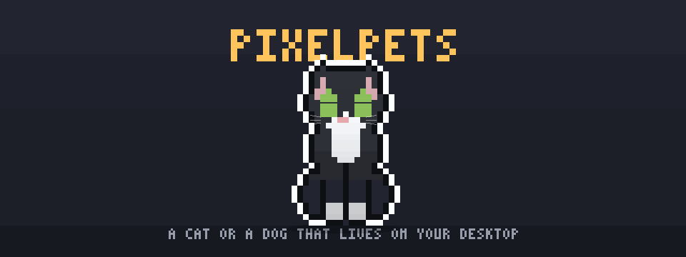
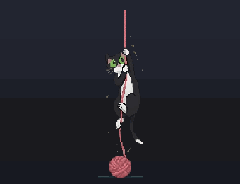
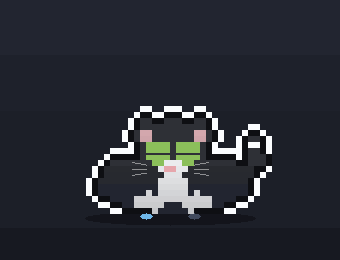
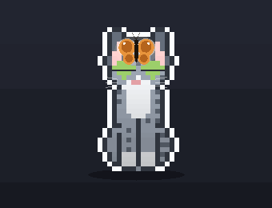
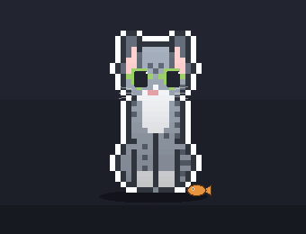
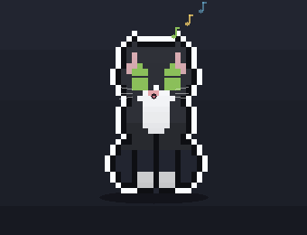
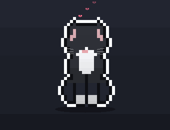
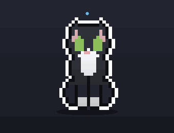
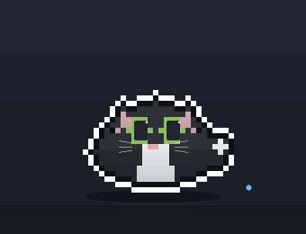
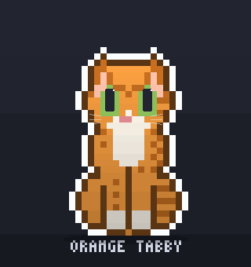

<div align="center">


# pixelpets

### A pixel cat or dog that lives on your desktop.

It sits in the corner, watches your cursor, kneads the keyboard when you type,
purrs when you pet it, and stretches like mochi when you drag it. Prefer a dog?
Switch species from the tray and you get a real one: a Black Lab with a wagging tail
that reads your pet's mood, a play bow instead of a hunting crouch, and a tennis
ball it will actually chase down and bring back. A desktop pet built from
scratch: nearly every sprite, animation, and sound is original and procedural.

<br />

[](https://github.com/JOhnsonKC201/pixelpets/stargazers)
&nbsp;[](https://github.com/JOhnsonKC201/pixelpets/actions/workflows/ci.yml)
&nbsp;[](https://github.com/JOhnsonKC201/pixelpets/releases/latest)
&nbsp;-4C566A?style=flat-square&labelColor=15161d)
&nbsp;[](LICENSE)

<br />



<sub>Every frame above is rendered from code, not screen capture. <a href="assets/hero-banner.mp4">MP4 version</a>.</sub>

<br />
<br />

[](https://github.com/JOhnsonKC201/pixelpets/releases/latest)
&nbsp;
[](https://pixelcat-jet.vercel.app)

<sub>The browser demo runs the real renderer: pet it, type at it, scroll to see it react, and wait for the butterfly.</sub>

<br />
<br />

<sub>
  <a href="#two-pets-one-app">Two pets</a>&nbsp;·
    <a href="#see-it-in-action">In action</a>&nbsp;·
    <a href="#what-it-actually-does">Features</a>&nbsp;·
    <a href="#quick-start">Quick start</a>&nbsp;·
    <a href="#meet-the-cat">Meet the cat</a>&nbsp;·
    <a href="#stay-on-track">Stay on track</a>&nbsp;·
    <a href="#controls">Controls</a>&nbsp;·
    <a href="#ai-agent-reactions">AI agents</a>&nbsp;·
    <a href="#custom-coats">Custom coats</a>&nbsp;·
    <a href="#how-it-works">How it works</a>&nbsp;·
    <a href="#privacy">Privacy</a>&nbsp;·
    <a href="#development">Development</a>&nbsp;·
    <a href="#contributing">Contributing</a>
</sub>

</div>

---

## Two pets, one app

Pick your species from the tray (**Pet → Cat / Dog**). Each one keeps its own
coat choice, so switching back and forth never loses your pick.

|  | Cat | Dog |
|---|---|---|
| Coats | 14 coats, from Orange Tabby to Russian Blue | the Black Lab |
| Resting | loafs into a "cat bread" | curls nose-to-tail into a ring |
| Excited | hunting crouch, ears back | **play bow**: chest down, rump up, tail flagged |
| Tail | slow rolling S-curve, tip flicks | fast wag from the base, shaped per breed (curl / plume / feather / stub / straight) |
| Play | bats a butterfly | **fetch**: chases the ball down, carries it home, drops it |
| Left alone | a butterfly flutters in | starts its own game of fetch |
| After exertion | grooms | pants, tongue out |
| Scroll | climbs a yarn rope, or swipes at a blowing leaf, depending on the coat | rears into a beg and swipes at the leaf |
| Reward | a fish treat | a tennis ball |

The dog is not a recoloured cat. It has its own sprite module with a muzzle that
protrudes past the skull line, floppy ears, a broader chest, and a straight
otter tail. Markings are coat *structures* rather than palette swaps, and the
build archetypes behind them (spotted, saddled, tricolour, masked, merle, and
the short-legged dwarf silhouette) are still in the sprite module for any breed
added back later.

```bash
npm run poses:dog   # previews/dog-poses.png - every breed x every ACTIVITY
npm run poses:cat   # previews/cat-poses.png - 14 coats x 11 activities
npm run sheet:dog   # previews/dog-sheet.png - the five base poses only
```

## See it in action

<table align="center">
<tr>
<td align="center"><br /><sub><b>Reacts when you scroll</b></sub></td>
<td align="center"><br /><sub><b>Kneads when you type</b></sub></td>
<td align="center"><br /><sub><b>Plays with a butterfly</b></sub></td>
</tr>
<tr>
<td align="center"><br /><sub><b>Noms a treat</b></sub></td>
<td align="center"><br /><sub><b>Sings and meows</b></sub></td>
<td align="center"><br /><sub><b>Purrs when you pet it</b></sub></td>
</tr>
<tr>
<td align="center"><br /><sub><b>Stretches like mochi</b></sub></td>
<td align="center"><br /><sub><b>Pounces on the cursor</b></sub></td>
<td align="center"><br /><sub><b>14 coats, plus your own</b></sub></td>
</tr>
</table>

<div align="center">
<sub>Every pose here is composed into the pet's own sprite, so all 15 coats and both species get every one of them in
their own colours. Everything is rendered from the sprite the pet draws with, generated headlessly by one script.
Nothing is a screen recording.</sub>
</div>

## What it actually does

|  |  |
|---|---|
| **It reacts to you** | Petting, dragging, typing, scrolling, and cursor play each get their own response, gated by an internal mood model that runs from calm up to zoomies and back. |
| **15 coats, one shape** | 14 cat coats and a Black Lab, all recolored at draw time from one role-coded sprite. Design, import, and export your own. |
| **No spare frames** | Every animation is composed into that sprite, limbs included, so all 15 coats across both species get every pose in their own colours without shipping a single extra image. |
| **Zero audio files** | The meow, the bark, the purr, the pant, and an endlessly improvising lo-fi jam are all synthesized live with Web Audio. |
| **It keeps you on track** | Break and Pomodoro timers, repeating reminders, a pinned note, IMAP unread-mail alerts, and calendar nudges, all delivered by your pet. |
| **It watches your agent** | It knows when your coding agent is thinking, working, or done, and reacts with its paws. Hook configs ship for five agents. |
| **It stays out of the way** | A transparent, click-through overlay that sits above every window. Only your pet is clickable. |

<div align="center">


<sub><b>Fourteen coats, one shape.</b> Every pose in every coat, recolored from a single role-coded sprite at draw time.</sub>

</div>

## Quick start

The Windows installer is the easy path. No git, no Node, just run it:

[](https://github.com/JOhnsonKC201/pixelpets/releases/latest)

You can also [play with the cat in your browser](https://pixelcat-jet.vercel.app) before installing anything.

> [!IMPORTANT]
> **Your OS will warn you the first time, and that is expected.** The builds are
> not code-signed yet, because a certificate costs real money for a free app.
>
> - **Windows:** SmartScreen shows a blue *"Windows protected your PC"* screen.
>   Click **More info**, then **Run anyway**.
> - **macOS:** Gatekeeper refuses a double-click. Try to open it once, then go to
>   **System Settings > Privacy & Security** and click **Open Anyway**. (On macOS 14
>   and earlier, right-clicking the app and choosing **Open** also works; macOS 15
>   removed that shortcut.)
>
> Would rather not? [Play it in your browser](https://pixelcat-jet.vercel.app)
> (the real renderer, nothing to install) or run it from source below. Both skip
> the installer entirely.
>
> What the app does on your machine is documented in
> [Privacy](#privacy) and [SECURITY.md](SECURITY.md): the keyboard hook forwards
> a single "a key was pressed" boolean and never what you typed.

To run from source (for development, or on macOS) you need git and Node 20 or newer:

```powershell
git clone https://github.com/JOhnsonKC201/pixelpets.git
cd pixelpets
npm install
npm start
```

Either way your pet appears in the corner and registers itself to start at login.
`npm run autostart:off` turns that off, and the installed version uninstalls like
any other program, from Windows Settings > Apps.

> [!TIP]
> **Windows, running from source:** `npm start` leaves a console window open behind
> the pet. `launch-pixelpets.vbs` starts the same thing silently, so it works as a
> desktop shortcut (point one at `wscript.exe "<path>\launch-pixelpets.vbs"`). It
> locates the project from its own path, so moving the folder does not break it.

> [!NOTE]
> **macOS (beta):** same commands. On first run, grant Accessibility permission
> (System Settings > Privacy & Security > Accessibility) so your pet can react to your
> typing and cursor. Input is only detected, never logged or sent anywhere. The mac
> port is code-complete but not yet smoke-tested on real hardware; see the
> [build checklist](#build-a-standalone-app). Issues welcome.

---

## Meet the cat

The whole point: a pet that *feels* alive on your desktop. It reacts to touch,
to your cursor, to your typing, and to its own internal mood.

| Interaction | What the cat does |
|-------------|-------------------|
| **Drag it** | Stretches like mochi (head and feet stay solid while the body thins), then squashes and bounces back. Shake it side to side and it wobbles like jello with a startled mrrp. It stays where you drop it. |
| **Pet its head** | Squeezes its eyes shut, wiggles, floats little hearts, and purrs. The squint holds through the whole stroke, not just when your hand stops moving. |
| **Touch its body** | Squints just as happily, leans and arches into your hand, tail up, trilling. |
| **Tap it** | A quick pet: happy eyes, hearts, a chirp. |
| **Move your cursor** | The cat watches it and blinks now and then. Flick the cursor fast and it crouches, stalks, and pounces. A sudden jolt startles it: it puffs up, freezes, then bolts or creeps back. |
| **Type in any app** | It leans onto two big keys and kneads them with its paws. Type fast enough and it overheats, turning red with steam, then cools down. |
| **Scroll anywhere** | Coats with hand-painted climb art grab a yarn rope and haul themselves up it, hand over hand, with a ball of yarn on the floor below. Every other coat, and every dog, rears up and swipes at a leaf blowing past in the direction you are scrolling, faster the harder you flick the wheel. |
| **Wait for a visitor** | Once in a while a butterfly flutters in. The cat tracks it, swats at it, and occasionally pounces and catches it between its paws before it flutters off. Step away from the keyboard and one comes out on its own, so the pet always has something to play with. Keep a dog instead and it starts its own game of fetch rather than waiting on a butterfly. |
| **Leave it be** | Left alone it keeps itself busy: it bats a drifting leaf with a paw, washes its face, loafs, and its whiskers twitch. Lively without ever getting in your way. |
| **Come back** | Return after being away and the cat notices you: happy eyes, a little heart, and a friendly chirp hello. |
| **Give it a treat** | Pick "Give a treat" from the tray and a little fish drops in. The cat trots over and noms it with hearts and a happy chirp. |
| **Late at night** | After 23:00 the cat winds down. It settles to calm faster and loafs or dozes more, though a nudge still rouses it. |

<details>
<summary><b>Coats and pixel art</b>: 14 built-in patterns, custom coats, a polished sticker look</summary>

- 14 coat patterns: Orange, Mackerel, and Brown tabby, Siamese, Tuxedo, Black,
  Gray, White, Cream, Tortoiseshell, Calico, Slate, Chocolate (a solid warm-brown
  Havana with green eyes), and Russian Blue (cool blue-grey with green eyes). It
  ships as Mackerel Tabby; right-click the cat to cycle, and your choice is remembered.
- Custom coats: design your own (see [Custom coats](#custom-coats)).
- The pixel art has a white sticker outline that pops on any wallpaper, soft
  top-lit shading, whiskers, a ground shadow, and sparkly eyes.
- The cat is one role-coded sprite recolored per pattern at draw time, so a
  dozen cats come from one shape, and shading, outline, and the overheat tint
  apply to every coat for free.

</details>

<details>
<summary><b>Moods and energy</b>: calm, playful, or zoomies, driven by what you do</summary>

The cat tracks an internal energy value (0 to 100) that decays over time and is
bumped by stimuli: typing, scrolling, fast-mouse play, petting, an AI agent
finishing. Energy maps to three mood bands that gate and scale every reaction:

| Band | Energy | Behaviour |
|------|--------|-----------|
| **Calm** | 0-50 | Mellow, with small and infrequent idle moves (loafs, grooms) |
| **Playful** | 51-80 | Full reactions (the original feel) |
| **Zoomies** | 81-100 | Frantic and fast, then a hard crash back toward calm |

Keep it busy and it gets the zoomies, then settles back down. Startle fires on
an abrupt cursor jump (no microphone, fully local). The whole system turns off
with the Mood reactions toggle (Settings or tray) for the classic always-playful
behaviour, and the tray Mood submenu has "Zoomies!" and "Calm down" to drive the
model on demand.

</details>

<details>
<summary><b>Sound</b>: synthesized meow, purr, chirp, and mrrp, with no audio files</summary>

The meow is a voiced sawtooth shaped by a moving mouth formant (it opens into
the "ee" and closes through the "ow"), with a breath of air on the onset and
gentle vibrato. Each meow randomly comes out as a short mew, a two-syllable
meow, or a drawn-out meeow, so it never sounds canned, and pitch and length
also vary by cat species. There is also a purr, a rolled chirrup trill (the
flutter cats greet you with), and a startled mrrp. All of it is synthesized
with Web Audio in code, so there are no audio assets to ship. Toggle it in
Settings.

</details>

<details>
<summary><b>Desktop-pet overlay</b>: floats over everything, never blocks your clicks</summary>

A full-screen, transparent, click-through layer: the cat floats over everything
but only the cat itself is interactive. It stays on top of every app (it
re-asserts top-most, even over fullscreen windows), and you can confine it to a
play area by picking a tray preset or drawing one with the mouse (tray > Set
play area). It starts at login by registering itself in Windows startup.

</details>

## Stay on track

pixelpets doubles as a quiet productivity companion. Every alert comes through
your pet, as a meow or a bark and a speech bubble, with an optional real
desktop notification.

<details open>
<summary><b>Focus Guard</b>: the pet works out when to leave you alone</summary>

A desktop pet that meows into the middle of a screen-share is a desktop pet you
uninstall. Focus Guard is the pet noticing you are busy without being told.

It reads "busy" from a calendar event that is actually happening now (an all-day
block is explicitly not a meeting, so *Vacation* cannot silence it for a whole
day), from Quiet Hours, or from Work mode. While you are busy the pet parks in
its rest corner and stops chasing things, and email, reminders and agent
messages **wait** rather than interrupt.

Nothing is thrown away. Held messages still land in the tray recap as they
arrive, and when you are free the pet sums them up in one line - *"While you
were busy: 3 new emails and 1 reminder."* Calendar nudges always come through,
because being told about the meeting you are about to miss is the opposite of an
interruption, and you can name senders under **Always tell me about** so the
people who matter reach you anyway.

</details>

<details>
<summary><b>Quiet hours</b>: a nightly do-not-disturb window</summary>

Set a From and To time and the pet goes silent between them - no meow, no
desktop notification. The speech bubble still appears, so a reminder that lands
at 3am is waiting for you in the morning rather than lost.

</details>

<details open>
<summary><b>Timers</b>: break reminders and Pomodoro</summary>

- Break timer: pick an interval and the cat grows big to stretch with you and
  meows, on a schedule. Or "Start break now."
- Pomodoro timer: set focus and break loops, and a pixel timer floats next to
  the cat (a tomato dot for focus, green for break). At the end of each focus
  block the cat stretches with you; when the break ends it meows "Back to
  focus!". Toggle in Settings or the tray.

</details>

<details>
<summary><b>Lobby Jam</b>: synthesized lo-fi study music the cat plays live</summary>

Flip on Lobby Jam (Settings or the tray submenu) and the cat picks up a little
guitar and plays an endlessly improvising lo-fi loop: plucked Karplus-Strong
guitar over lazy jazz voicings, soft bass, brushed percussion, and tape warmth.
It is all Web Audio, generated live, with no audio files. Pick a mood:

| Mood | For |
|------|-----|
| **Cozy café** | A warm, easy background loop |
| **Dreamy** | Slow and washed out, with lots of reverb |
| **Upbeat lounge** | Brighter and a touch faster |
| **Deep focus** | Steady and minimal, almost no flourishes, so it stays out of the way while you work |
| **Rainy study** | A cozy loop over a soft, gusting rain bed |
| **Sleepy night** | Very slow, warm, and dark, for late-night wind-down |

The music mixes through the same Volume control as the meow and purr, and the
floating notes and the cat's strumming bob along in time with the beat.

</details>

<details>
<summary><b>Reminders and notes</b>: timed, repeating, snoozable</summary>

- Reminders: set a time and a message and the cat meows and shows a speech
  bubble. Reminders can repeat (daily, weekdays, specific weekdays, or once),
  can be snoozed from the tray, and support `{name}`, `{time}`, and `{date}`
  placeholders.
- Pinned note: pin an important message and it stays in a bubble above the
  cat's head until you clear it. Reminders briefly take over, then it returns.
- It calls you by name: tell the cat your name in Settings (or use `{name}`)
  and it greets you with it.
- Desktop alerts: every reminder can also raise a real Windows notification and
  a sound, so you never miss one when you are not looking at the cat.

</details>

<details>
<summary><b>Mail and calendar</b>: IMAP unread alerts and <code>.ics</code> event nudges</summary>

- Unread-mail alerts: point the cat at your IMAP inbox (Gmail, Outlook, anything
  IMAP) and it tells you who the mail is from - *"Alice: Budget review"* - so you
  can decide from the bubble instead of going to look. Name the senders you never
  want to miss under **Always tell me about**, and they reach you even while
  Focus Guard is holding everything else back; a bare domain like `@acme.com`
  covers everyone there. Your app password is stored encrypted at rest (Electron
  `safeStorage`, which is DPAPI on Windows), never in `settings.json`, and the
  IMAP connection runs in an isolated worker process.
- Calendar nudges: paste your calendar's secret `.ics` URL (Google and Outlook
  both provide one) and the cat nudges you a few minutes before each event. The
  feed is fetched and parsed in an isolated worker.

</details>

<details>
<summary><b>Notify the cat</b>: push any message from a script, CI, or cron job</summary>

Any script or tool can make the cat deliver an arbitrary message: a speech
bubble, a Windows toast, and a meow.

```bash
node scripts/notify.js "Build finished" --title CI --level success
node scripts/notify.js "Coffee break ☕" --ttl 8000
echo "anything" | node scripts/notify.js "Deploy done"   # hook-safe (drains stdin)
```

Flags: `--title <T>`, `--level info|success|warn|alert`, `--ttl <ms>`,
`--no-sound`. The script appends one JSON line to `%TEMP%/pixelcat-notify.jsonl`
and the running pet tails the file. Lines written before the pet launched are
ignored (no backlog replay), and calling it while the pet is closed is harmless.

</details>

## Controls

| Action | What it does |
|--------|--------------|
| **Drag** the cat (hold left) | Stretches it like mochi; it drops where you release |
| **Right-click** the cat | Cycles to the next coat pattern |
| **Tap** the cat | A quick pet: happy eyes, hearts, a chirp |
| **Rest cursor on its head** | Happy eyes, floating hearts, and a purr |
| **Rest cursor on its body** | Leans and arches into your hand, tail up, trilling |
| **Type** (any app) | Front-paw kneading; fast typing overheats it |
| **Scroll** (any app) | Climbs a yarn rope, or rears up and swipes at a blowing leaf |
| **Double-click** the cat | Opens Settings (name, timers, reminders, coat) |
| **Tray icon** | Settings, Start break now, coat picker, play area, sound and hunt and mood toggles, Quit |

Settings persist to `settings.json` in your per-user app-data folder
(`%APPDATA%/pixelpets/` on Windows, `~/Library/Application Support/pixelpets/` on
macOS). An install that predates the rename is migrated across on first launch. Timers and reminders only fire while
pixelpets is running, and reminder times use your local clock.

## AI agent reactions

The cat reacts to a coding agent's work status, and it uses its paws to do it.
It raises a paw to its chin to ponder (with a "…" bubble) while an agent like
Claude Code, Codex, or Cursor thinks, taps a paw along with a spinner while it
works, and does a happy hop and meow when it finishes. Any tool can signal it by
running the bundled helper, which writes a tiny status file the cat watches
(`%TEMP%/pixelcat-agent.state`):

```bash
node agent-hook.js thinking   # ponders, paw to chin + "…" bubble
node agent-hook.js editing    # taps a paw + "working" spinner (also: writing/testing/building/running)
node agent-hook.js error      # the cat startles (flinch)
node agent-hook.js done       # happy hop + meow
node agent-hook.js idle       # back to normal
```

Ready-to-use hook configs for five agents live in [`integrations/`](integrations/).
Copy the one for your agent and replace the path with your checkout:

| Agent | Setup |
|-------|-------|
| **Claude Code** | merge [`integrations/claude-code/settings.hooks.json`](integrations/claude-code/) into `~/.claude/settings.json` |
| **Codex CLI** | merge [`integrations/codex/config.toml`](integrations/codex/) into `~/.codex/config.toml` |
| **Cursor** | copy [`integrations/cursor/hooks.json`](integrations/cursor/) to `<project>/.cursor/hooks.json` |
| **Antigravity** | add hooks to `.agents/hooks.json`, per [`integrations/antigravity/`](integrations/antigravity/) |
| **Kiro** | add hooks via the Agent Hooks UI, per [`integrations/kiro/`](integrations/kiro/) |

The mapping: prompt and submit events signal `thinking`, tool calls and file
edits signal `working`, and stop or complete signals `done`. Use the absolute
path to `agent-hook.js`, since hooks run from varying directories (forward
slashes work on Windows too). The helper is hook-safe: it drains stdin and
replies `{"continue": true}`, so it never blocks or alters your agent.

> Tip: `node scripts/install-hook.js <agent>` (or `npm run hook -- <agent>`)
> prints the config with the absolute path already filled in.

<sub>The richer status reactions were inspired by the open-source AI desktop pets
[openpets](https://github.com/alvinunreal/openpets) (MIT) and
[clawd-on-desk](https://github.com/rullerzhou-afk/clawd-on-desk) (AGPL-3.0).
Ideas only; all code here is original to pixelpets.</sub>

## Custom coats

Design your own under Settings > Pet > Custom coats > "+ Add a custom coat": pick
a name, a body build (standard, slender, stocky, or fluffy), optional tabby
stripes, and eight colours (coat, marks, white, patch, eyes, nose, inner ear,
outline). Your coat shows up in the Coat dropdown and the tray menu next to the
14 built-ins. Custom coats are built from the cat's geometry, so they apply to
cats only; the Pet tab says so when a dog is selected.

Custom coats live in `themes.json` in your app-data folder
(`%APPDATA%/pixelpets/themes.json`) and can be hand-edited too:

```json
{ "themes": [
  { "name": "Galaxy", "build": "fluffy", "tabby": false,
    "coat": "#3b2f63", "mark": "#2a2147", "white": "#c9c0e8", "patch": "#7a5cc0",
    "eye": "#7fd6ff", "nose": "#e0a0c0", "inner": "#9a7ad0", "outline": "#15101f" } ] }
```

Every colour role is required and must be a `#rrggbb` hex (invalid themes are
skipped). Preview one without the overlay: `npx electron . --shot --pattern=galaxy`.
Share coats with Export and Import in the same panel; they write and read a JSON
file, and imported coats merge into your set by name.

## Build a standalone app

```powershell
npm run pack    # portable build -> dist/win-unpacked/pixelpets.exe (no installer)
npm run dist    # Windows installer -> dist/pixelpets Setup <version>.exe
```

`pack` works out of the box. `dist` (the NSIS installer) needs permission to
create symlinks while electron-builder unpacks its bundled signing tools:
enable Windows Developer Mode (Settings > Privacy & security > For developers)
or run the build once from an Administrator terminal. The native `uiohook-napi`
module ships N-API prebuilds, so `npmRebuild` is disabled in the build config
and no Visual Studio is needed. `npm run icon` regenerates the procedural app
and tray icons.

**macOS:** `npm run dist:mac` (on a Mac) builds a dmg and zip for Apple Silicon
and Intel; the release workflow also builds them in CI on every version tag.
Builds are ad-hoc signed rather than notarized, so Gatekeeper still asks before
the first launch: open it once, then **System Settings > Privacy & Security >
Open Anyway**. (The ad-hoc seal matters for more than the warning - macOS keys the
Accessibility grant and the Keychain entry to a code signature, so without it both
would be thrown away on every update.) The mac port
is code-complete but not yet smoke-tested on real hardware. If you have a Mac,
the checklist is: the overlay shows over all apps and Spaces (including
fullscreen), clicks pass through except on the cat, the typing reaction works
after granting Accessibility, the cat rests on the Dock edge (not the menu
bar), the tray menu works in the menu bar, and login launch works.

## Drive it from an iPad

```
npm run ipad:lan
```

That prints a URL. Open it in Safari on the iPad and you have a real terminal - `vim`,
`top`, tab completion, colours - on **this** machine. Share → Add to Home Screen gives
it an icon and a full-screen window.

The honest limitation first, because it is the reason the tool works this way: nothing
running on an iPad can control other iPad apps. iPadOS sandboxes every app, Apple
exposes no API for cross-app control, and no terminal on the App Store gets around it -
Shortcuts is the only sanctioned path, and only for apps that publish App Intents. So
this puts the shell on the computer, where a shell is worth having, and lets the iPad be
the screen and the keyboard.

It is built for a tablet: a key bar supplies the Esc, Tab, Ctrl and arrows the soft
keyboard lacks, and because Safari suspends a backgrounded tab, the shell outlives the
connection and replays exactly the output you missed when you come back.

It is a shell running as you, over plain HTTP. Fine on your own Wi-Fi, not fine anywhere
else - see [`tools/ipad-terminal/`](tools/ipad-terminal/) for the full notes.

## How it works

- The cat is one role-coded sprite (outline, coat, markings, white, patch, eye,
  nose, inner ear) built procedurally, then recolored per pattern at draw time,
  so a dozen cats come from one shape.
- Every pose is composed into that same grid, including the limbs. A raised paw
  is made of the same cells as the rest of the pet, so it picks up the coat's
  shading, outline halo, markings and breathing scale for free. Nothing is
  painted on top afterwards. That is why washing, pondering, batting a leaf,
  boxing at the butterfly and swiping at the scroll leaf all work in all 15 coats
  and both species without a single extra sprite asset.
- Poses that vary continuously (how high a paw is raised, how far it reaches,
  which paw is mid-swipe) are quantised to a handful of steps and memoised, and
  built only for the coat currently on screen. Pixel art wants stepped limbs
  anyway, so the cheap thing and the right-looking thing are the same thing.
- Rendering happens on an HTML canvas in a full-screen transparent Electron
  window. Ordinary screenshots cannot capture it (it is GPU-composited), so
  previews use a self-capture:
  `electron . --shot --pattern=<name> [--species=cat|dog] [--state=<pose>] [--at=<ms>]`.
- The mochi drag is a spring system (a pinned handle plus a trailing body
  point) with a three-band stretch that keeps the head and feet rigid.
- Break timers and reminders are scheduled in the main process (the renderer
  throttles and pauses when idle), which pushes fire events to the cat over
  IPC. Sound is synthesized with Web Audio in the renderer, so there are no
  audio assets to ship: every meow, bark, purr, pant, swipe and thud is
  generated live, and so is the lo-fi jam.

### Project layout

```
pixelpets/
  src/
    main.js                # overlay window, global input hooks, tray + menu,
                           #  scheduler (breaks, reminders, Pomodoro), config IPC
    renderer.js            # the pet: sprites, palettes, physics, reactions, sound
    preload.js             # safe IPC bridge for the overlay
    cat-sprite.js          # the role-coded cat, mirrored to site/ for the browser demo
    dog-sprite.js          # the Black Lab, and the poses composed from it
    pets.js                # per-species registry: menu labels, IPC channels, copy
    patterns.js            # shared coat list, recolored at draw time
    art-frames.js          # baked hand-painted poses that win over the composer
    climb-frames.js        # the yarn-rope climb, per coat
    audio.js               # synthesized voice: meow, purr, bark, pant, chirp
    jam.js                 # the live lo-fi jam, generated bar by bar
    effects.js / bubble.js # hearts and leaves, and the speech bubble
    focus.js               # when to leave you alone: meetings, work mode, quiet hours
    quiet-hours.js         # the nightly do-not-disturb window
    mail.js / mail-worker.js   # IMAP unread-mail checks (isolated worker)
    cal.js  / cal-worker.js    # .ics calendar feed (isolated worker)
    config.js              # settings.json load/save/normalize (per-user app data)
    datadir.js             # one-time rescue of that folder after the rename
    themes.js              # custom-coat load/validate
    template.js            # message placeholders: {name}, {time}, {date}, {count}
    index.html             # the overlay page
    settings*.{html,js}    # settings window + its IPC bridge
  tests/                   # node:test suites, no Electron and no GPU required
  scripts/                 # the vm harness, icon and demo generators, notify.js,
                           #  install-hook.js, the boot check
  tools/ipad-terminal/     # browser terminal for this machine, driven from an iPad
  integrations/            # ready-made agent hook configs (5 agents)
  assets/                  # generated icons, showcase, hero + gallery clips
  site/                    # the browser demo deployed to Vercel
  docs/                    # frame-pack guide, and the early coat studies
  extras/                  # the standalone Lobby Jam page
  .github/                 # CI and release workflows, issue and PR templates
```

## Privacy

Your pet reacts to your typing and scrolling, which means it listens to global
input events, so here is the plain statement: input is used only to trigger
animations, in the moment, on your machine. Keystrokes are never logged,
stored, or sent anywhere. There is no telemetry and no auto-update. The app
makes no network connections at all unless you set up the optional mail or
calendar alerts, and those talk only to the servers you point them at, from
isolated worker processes. Your IMAP app password is stored encrypted at rest
(Electron `safeStorage`) and never written to `settings.json`.

## Development

```powershell
npm start                 # run the app
npm test                  # 200+ tests: config and data migration, poses, interactions,
                          #  audio, focus and quiet hours, mail and calendar, site drift
npm run lint              # eslint over src, tests, scripts and site (what CI runs)
npm run test:boot         # launch the real app and assert it renders a frame
npm run poses:cat         # previews/cat-poses.png (every activity x every coat)
npm run poses:dog         # the same for the Black Lab
npm run frames:import -- <dir>   # import painted PNGs as baked poses
npm run demo:all          # regenerate the README media (hero, gallery, carousel)
npm run hook -- cursor    # print a path-filled agent hook config
npm run icon              # regenerate the tray + app-tile icons
```

CI runs `npm run lint`, `npm test`, and the boot check on Windows and macOS for
every push and pull request.

**Painting a pose by hand.** Every pose is composed in code, which is why one
`sit` covers 15 coats and a new coat costs nine hex values instead of an art pass.
The trade is that changing how the pet looks means editing geometry.
`npm run frames:import` is the escape hatch: paint a pose against a placeholder
palette, import it, and it wins over the composer for exactly the coats you name
while everything else keeps composing. Five held poses can be baked (`sit`,
`type`, `loaf`, `rear`, `hunt`); the six raised-limb activities are parameterised
rigs whose limbs sweep through quantised frames, so a still would freeze them.
Palette, naming and the checks the importer runs are in
[docs/frame-pack.md](docs/frame-pack.md).

**Visual QA.** The overlay is GPU-composited, so ordinary screenshots cannot
capture it. Poses are reviewed with a one-command contact sheet instead:
`npm run poses:cat` renders **every activity across every coat** into one image,
bottom-aligned on a shared floor line so silhouettes can be compared down a
column. It runs headlessly, with no Electron and no GPU, by loading the overlay's
script stack in a vm (`scripts/overlay-vm.js`) and reading the pose grids back
out. That is also what the pose tests drive, so the sheet and the suite are
looking at exactly the same sprites.

**README media.** The hero banner, the gallery above, and the coat carousel are
all rendered from the same sprite geometry by `scripts/make-demo-gif.js`, in
pure Node with no browser or GPU. Regenerate any one with
`node scripts/make-demo-gif.js <hero|gallery|carousel> [mp4]`, or all of them
with `npm run demo:all`.

Single poses preview via
`npx electron . --shot --state=<sit|typing|hunt|loaf|groom|paper|overheat|pet|startle|work> --pattern=<coat>`.
Add `--at=<ms>` to capture an animated pose at a chosen phase (a typing
key-press, say): `npx electron . --shot --state=typing --at=760`. Add
`--note="<text>"` to pin a speech bubble open in the capture, which is how bubble
wrapping and screen-edge clamping get checked against a real font rather than only
in unit tests: `npx electron . --shot --note="a long reminder that has to wrap"`.

### Tech

Electron · HTML canvas · Web Audio · [`uiohook-napi`](https://github.com/SnosMe/uiohook-napi)
(system-wide keyboard hook) · [`imapflow`](https://github.com/postalsys/imapflow) ·
[`node-ical`](https://github.com/jens-maus/node-ical).

## Contributing

Bug reports, ideas, and PRs are all welcome. Start with the
[contributing guide](CONTRIBUTING.md); the [security policy](SECURITY.md)
covers reporting a vulnerability privately. If you own a Mac, running the
[beta checklist](#build-a-standalone-app) and opening an issue with whatever you
see is the single most useful contribution right now: the port is code-complete
and the builds are ad-hoc signed, but nobody has run one on real Apple hardware. Custom coats and desk setups
belong in [Discussions](https://github.com/JOhnsonKC201/pixelpets/discussions),
and release history lives in the [changelog](CHANGELOG.md).

---

<div align="center">

Made for fun. All art, code, and sound are original; the meow and purr are
synthesized in code, with no audio files. pixelpets is inspired by, not copied
from, Comnyang: no Comnyang assets, sprites, audio, or branding are used.

[**MIT**](LICENSE) © [JOhnsonKC201](https://github.com/JOhnsonKC201)

</div>
